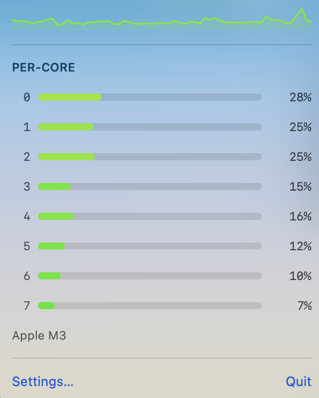
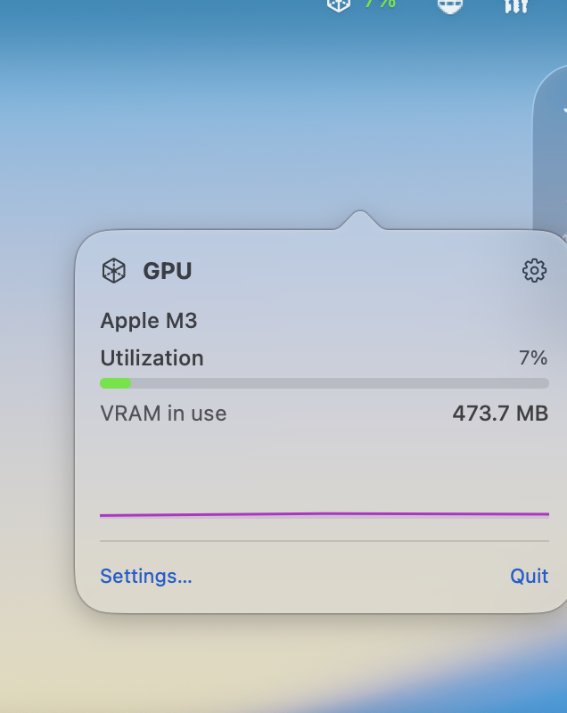
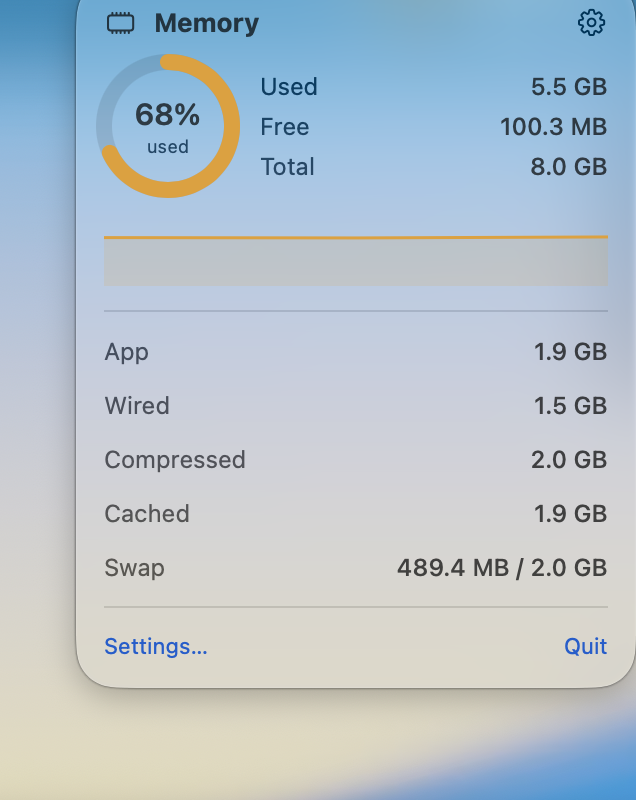
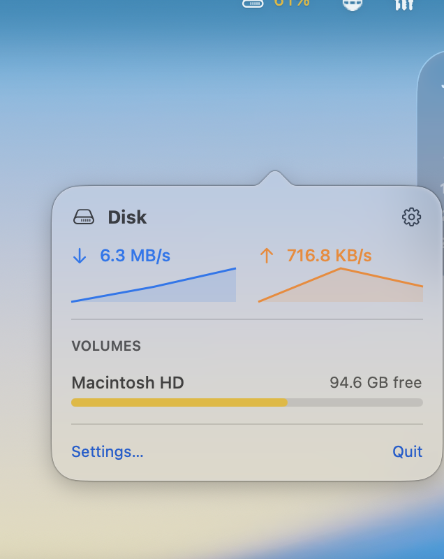
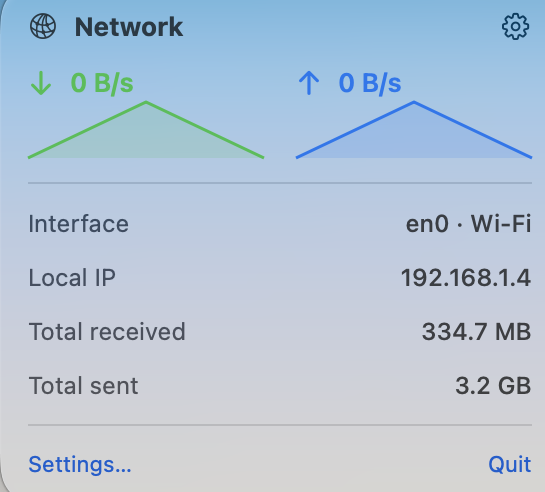
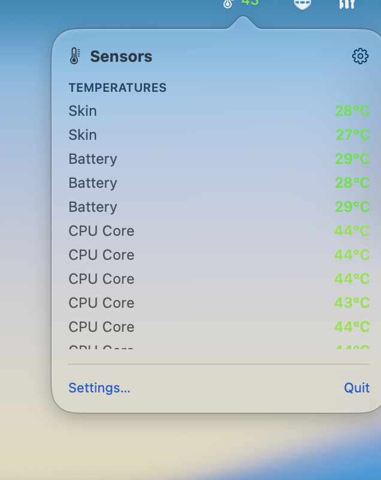
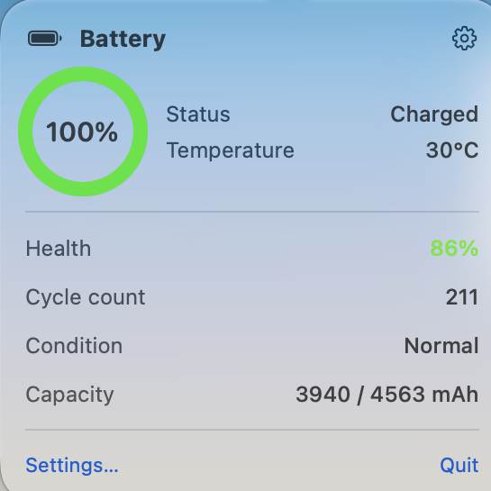
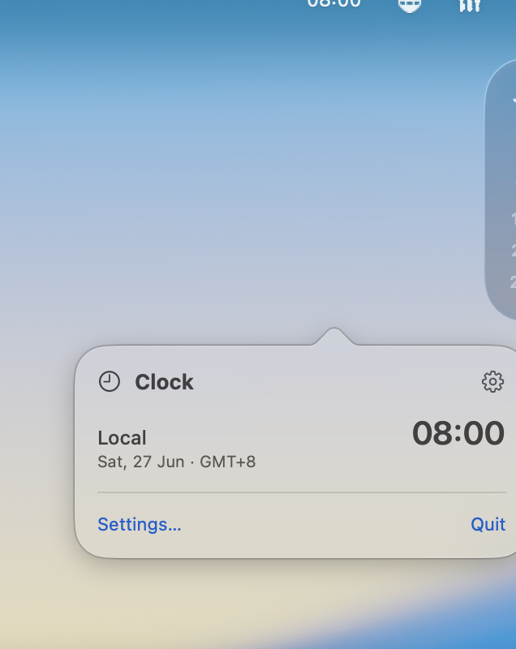

<div align="center">

# Better Mac Stats

### Monitor sistem macOS di menu bar yang ringan & native — CPU, GPU, memori, disk, jaringan, baterai, suhu, kipas & Bluetooth.

Alternatif **Activity Monitor**, **[Stats](https://github.com/exelban/stats)** dan **iStat Menus** yang gratis & open‑source untuk Mac **Apple Silicon (M1/M2/M3/M4)** dan **Intel**.

[](https://www.apple.com/macos/)
[](https://swift.org)
[](#persyaratan)
[](LICENSE)
[](https://github.com/ariwisnu/better-mac-stats/stargazers)

[English](README.md) · **Bahasa Indonesia**

</div>

> Pantau Mac tanpa pernah membuka Activity Monitor. Tiap metrik jadi item menu bar
> terpisah yang membuka popover live yang rapi. Nyalakan/matikan modul untuk hemat
> CPU dan baterai — cukup tampilkan yang benar‑benar ingin kamu pantau.

```
┌──────────────────────────────  menu bar kamu  ──────────────────────────────┐
   …            cpu 23%   69%   ↓1.2M ↑40K   61°   100%⚡   14:05               
└──────────────────────────────────────────────────────────────────────────────┘
                     │
                     ▼  klik kiri item mana pun
        ╭────────────────────────────╮
        │  CPU                    ⚙︎  │
        │   ◯ 23%   System  6%       │
        │           User    17%      │
        │           Temp    61°C     │
        │  ▁▂▃▅▇▅▃▂▁  (riwayat live)  │
        │  Cores ▇▅▃▂ ▂▁▃▅ …         │
        ╰────────────────────────────╯
```

<div align="center">

<br>
<sub><em>Semua metrik, langsung di menu bar.</em></sub>

<br><br>


</div>

## Daftar isi

- [Fitur](#fitur)
- [Tangkapan layar](#tangkapan-layar)
- [Kenapa Better Mac Stats?](#kenapa-better-mac-stats)
- [Persyaratan](#persyaratan)
- [Instal & build](#instal--build)
- [Cara pakai](#cara-pakai)
- [Pengaturan](#pengaturan)
- [Arsitektur](#arsitektur)
- [Widget](#widget)
- [Roadmap](#roadmap)
- [FAQ](#faq)
- [Kontribusi](#kontribusi)
- [Lisensi](#lisensi)

## Tangkapan layar

> Klik kiri item menu bar mana pun untuk membuka popover langsungnya. Tangkapan asli di Apple M3.

<table>
<tr>
<td align="center"><br><b>CPU</b><br><sub>beban per‑core + histori</sub></td>
<td align="center"><br><b>GPU</b><br><sub>utilisasi + VRAM</sub></td>
<td align="center"><br><b>Memori</b><br><sub>rincian tekanan</sub></td>
</tr>
<tr>
<td align="center"><br><b>Disk</b><br><sub>I/O + volume</sub></td>
<td align="center"><br><b>Jaringan</b><br><sub>throughput + IP</sub></td>
<td align="center"><br><b>Sensor</b><br><sub>suhu</sub></td>
</tr>
<tr>
<td align="center"><br><b>Baterai</b><br><sub>kesehatan + siklus</sub></td>
<td align="center"><br><b>Jam</b><br><sub>multi‑zona waktu</sub></td>
<td></td>
</tr>
</table>

## Fitur

| Modul | Tampil di menu bar | Detail popover |
|-------|--------------------|----------------|
| 🧠 **CPU** | total load % | bar per‑core, pisah system/user, suhu, sparkline live, nama chip |
| 🎮 **GPU** | utilisasi % | utilisasi, VRAM terpakai, nama GPU (Intel / AMD / Apple) |
| 🧩 **Memory** | terpakai % | used/free/total, app·wired·compressed·cached, swap, sparkline |
| 💽 **Disk** | terpakai % (volume utama) | throughput baca/tulis + sparkline, bar kapasitas tiap volume |
| 🌐 **Network** | kecepatan ↓ / ↑ | up/down + sparkline, interface, Wi‑Fi/Ethernet, IP lokal, total |
| 🔋 **Battery** | % (+ ikon ngecas) | status, sisa waktu, cycle count, kesehatan, kondisi, suhu |
| 🌡️ **Sensors** | suhu CPU tertinggi | semua suhu SMC, RPM kipas, dan sensor daya |
| 📶 **Bluetooth** | jumlah terhubung | perangkat ter‑pairing, status koneksi, kekuatan sinyal |
| 🕒 **Clock** | jam saat ini | banyak zona waktu dunia lengkap dengan tanggal & offset GMT |

- ⚡ **Ringan** — seluruh app **di bawah 1 MB** dan idle sekitar **0.4% CPU**.
- 🎛️ **Bisa diatur** — pilih modul yang tampil, urutkan, atur refresh (500 ms – 10 s),
  pilih °C/°F, byte vs bit, pewarnaan & ikon.
- 🚀 **Jalan saat login** — via `SMAppService` (macOS 13+) atau LaunchAgent (macOS 12).
- 🍏 **Benar‑benar native** — AppKit `NSStatusItem` + popover SwiftUI. Tanpa Electron,
  tanpa webview background, tanpa telemetri.
- 🛡️ **Aman di semua Mac** — kipas tidak ada, desktop tanpa baterai, atau SMC yang
  kosong ditampilkan sebagai empty state ramah, bukan crash.

## Kenapa Better Mac Stats?

|  | **Better Mac Stats** | Activity Monitor | iStat Menus |
|--|:--:|:--:|:--:|
| Harga | **Gratis & open source** | Gratis | Berbayar |
| Hidup di menu bar | ✅ 9 modul | ❌ | ✅ |
| CPU per‑core + suhu + kipas | ✅ | sebagian | ✅ |
| Apple Silicon **dan** Intel | ✅ | ✅ | ✅ |
| Ukuran app | **< 1 MB** | — | ~30 MB |
| Open source / bisa dioprek | ✅ | ❌ | ❌ |

Terinspirasi dari [exelban/stats](https://github.com/exelban/stats) yang keren;
Better Mac Stats fokus ke basis kode yang mungil, mudah dibaca, dan tanpa
dependensi sehingga bisa di‑build dan dikembangkan dalam hitungan menit.

## Persyaratan

- **macOS 12 Monterey atau lebih baru** (di‑build & diuji di macOS 26, Apple M3).
- Toolchain Swift — **Xcode** penuh atau **Command Line Tools**
  (`xcode-select --install`).
- Universal: jalan di **Apple Silicon** dan **Intel**.
- Tanpa dependensi pihak ketiga.

## Instal & build

```bash
git clone https://github.com/ariwisnu/better-mac-stats.git
cd better-mac-stats

Scripts/build.sh              # → dist/BetterMacStats.app (arm64)
UNIVERSAL=1 Scripts/build.sh  # universal arm64 + x86_64
open dist/BetterMacStats.app  # jalankan

Scripts/run.sh                # build (jika perlu) + jalankan
Scripts/test.sh               # jalankan unit test
```

> **Kenapa pakai script, bukan `swift build`?**
> Command Line Tools bawaan Swift 6.3.2 punya `libPackageDescription` yang rusak —
> gagal me‑link manifest SwiftPM apa pun (bahkan yang kosong), dan `xcodebuild`
> butuh Xcode penuh. Script meng‑compile langsung dengan `swiftc`. `Package.swift`
> tetap disertakan dan build normal di Xcode yang sehat.

## Cara pakai

- **Klik kiri** item menu bar → popover detail live.
- **Klik kanan** (atau ⌃‑klik) item mana pun → menu **Settings…**, **Launch at
  Login**, dan **Quit**.
- Matikan semua modul dan tetap tersisa satu item ⚙︎ agar app tetap bisa diakses.

## Pengaturan

| Tab | Yang bisa diubah |
|-----|------------------|
| **General** | Jalan saat login · interval refresh (500 ms – 10 s) |
| **Modules** | Aktif/nonaktif tiap modul · seret untuk mengurutkan menu bar |
| **Appearance** | Ikon menu bar · nilai berwarna · °C/°F · byte vs bit/s |
| **Clock** | Tambah/hapus zona waktu · format 24‑jam & detik per zona |

## Arsitektur

```
Sources/
  BetterMacStatsCore/   Layer data murni (tanpa AppKit) — reader, model, formatting
    Readers/            CPU · Memory · Network · Disk · Battery · GPU · SMC · Bluetooth · Clock
    Models/  Util/
  BetterMacStats/       App — menu bar AppKit, popover SwiftUI, settings
Tests/                  Unit test
Widget/                 Ekstensi WidgetKit opsional
Scripts/                build · run · test · typecheck
```

Semuanya pakai API publik macOS: `host_processor_info` / `host_statistics64`
(CPU & memori), `getifaddrs` (jaringan), registry IOKit (I/O disk, GPU, baterai),
`IOPSCopyPowerSourcesInfo` (baterai), **AppleSMC** (suhu, kipas, daya) dan
**IOBluetooth** (perangkat). Pemisahan `Core` ↔ `App` membuat layer data mudah
diuji dan dipakai ulang (termasuk oleh widget).

## Widget

Folder `Widget/` berisi widget **WidgetKit** opsional (small + medium) yang
menampilkan CPU, memori, dan baterai. Karena Widget Extension adalah bundle
`.appex` terpisah, ia butuh Xcode penuh: tambahkan target *Widget Extension*,
sertakan `Widget/BetterMacStatsWidget.swift` + sumber `BetterMacStatsCore`, dan
pakai `Widget/Info.plist`.

## Roadmap

- [x] Modul CPU, GPU, memori, disk, jaringan, baterai, sensor, Bluetooth, jam
- [x] Popover per‑modul dengan sparkline live
- [x] Settings (modul, interval, tampilan, zona waktu dunia)
- [x] Jalan saat login (macOS 12 + 13+)
- [x] Sumber WidgetKit
- [ ] Embed widget sekali klik (tanpa Xcode)
- [ ] Notifikasi ambang suhu / baterai
- [ ] Interval refresh per‑modul
- [ ] Rilis ter‑notarize & Homebrew cask

Kontribusi untuk poin mana pun sangat diterima. ⭐ **Star repo ini** untuk mengikuti!

## FAQ

**Jalan di Apple Silicon?** Ya — M1, M2, M3, dan M4. Suhu dibaca langsung dari SMC.
Mac Intel juga didukung.

**Boros baterai?** Tidak. Idle sekitar 0.4% CPU, dan modul nonaktif tidak di‑poll
sama sekali. Perbesar interval refresh untuk lebih hemat lagi.

**Mengirim data ke luar?** Tidak pernah. Tanpa panggilan jaringan, tanpa analitik,
tanpa telemetri.

**Kenapa ada metrik yang hilang?** Sebagian Mac tidak mengekspos sensor tertentu
(mis. Mac tanpa kipas, desktop tanpa baterai). Itu ditampilkan sebagai empty state.

## Kontribusi

Issue dan pull request diterima. Basis kodenya kecil, terdokumentasi, dan tanpa
dependensi — tempat bagus untuk belajar pemrograman sistem macOS. Jalankan
`Scripts/test.sh` sebelum mengirim PR.

## Lisensi

[MIT](LICENSE) © kontributor. Terinspirasi dari [exelban/stats](https://github.com/exelban/stats).

<div align="center">

Kalau Better Mac Stats berguna buat kamu, tolong **⭐ star repo‑nya** — sangat membantu!

<sub>monitor sistem macOS di menu bar · alternatif Activity Monitor · alternatif Stats · alternatif iStat Menus · monitor CPU GPU memori disk jaringan baterai suhu kipas Bluetooth · Apple Silicon M1 M2 M3 M4 · Intel · Monterey Ventura Sonoma Sequoia</sub>

</div>
